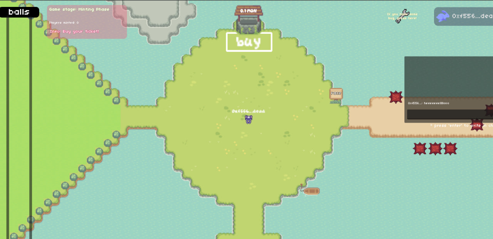
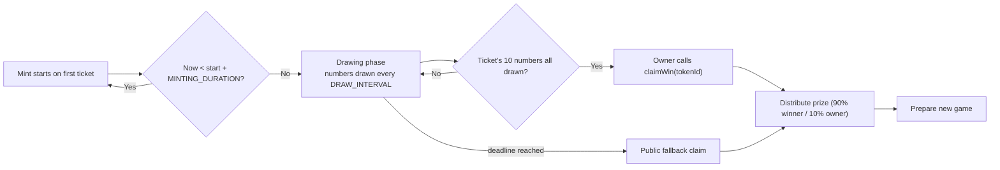

# Lotonad

## *A tiny 2D on‑chain world where the main event is a loto on Monad*

[](#)
[](#)
[](https://multisynq.io/)
[](https://testnet.monad.xyz/)
[](#license)

Lotonad is a small "meta‑world" built with **Godot** that mixes a main **on‑chain loto** (play with MON on the **Monad** testnet) with a couple of fast mini‑games you can play while waiting for the next draw: **TNT‑Run** and an **Obstacle Race**.
Multiplayer is powered by **Multisynq** (WebSocket P2P‑style sync). Game state for the loto is verified by a **Solidity** smart contract — **no admin switches**, phases advance by **time** and **deterministic draws**.

> **Screenshot**
>
> 

---


## Features

* 🎲 **On‑chain loto** on **Monad** testnet; buy a ticket with MON and watch numbers draw on‑chain.
* ⏱️ **Time‑driven phases** (no admin toggles): mint → draw → claim → auto new game.
* 🧠 **Deterministic draws** from a per‑game seed (verifiable & backend‑computable).
* 🛡️ **Spam‑resistance**: one mint per player per game, limited claim attempts, public fallback claim.
* 🕹️ **While‑you‑wait mini‑games**: TNT‑Run and Obstacle Race (multiplayer).
* 🌐 **Multiplayer** via **Multisynq**: live positions/actions synced between players.
* 🎮 Built with **Godot 4.x**: web build targets browser play.
* 🖼️ In‑game NFTs with **on‑chain SVG metadata** (winner / lose styling).
* 📦 Single‑call **`getGameSnapshot`** view for efficient UI resync.

---

## How It Works

1. **Minting** starts when the **first ticket** of a game is minted.
2. After the mint window, the contract **reveals numbers** on a fixed interval.
3. The owner of a ticket whose 10 numbers are all drawn firstly can **claim** the prize.
4. If nobody claims in time, **public fallback** allows anyone to resolve the game and distribute rewards.
5. The contract **automatically prepares the next game** — no manual admin steps.

---

## Smart Contract (Solidity)

Deployed on the **Monad testnet**. The contract is designed to be **hands‑off**:

* **No admin phase switches** — phases are determined by timestamps.
* **Anti‑spam constraints** — one ticket per player per game, **`MAX_CLAIM_ATTEMPTS`**, exact pricing.
* **Public liveness** — **`PUBLIC_CLAIM_GRACE`**: if a winner doesn’t show up in time, anyone can finalize.
* **Deterministic draws** — per‑game seed + Fisher‑Yates style shuffle for the 1..99 number set.
* **Snapshot API** — **`getGameSnapshot(address)`** returns everything the UI needs in one call.

> ⏱️ **Timing constants** are configurable.
> In the snippet below, `MINTING_DURATION` is set to **4 minutes** and `DRAW_INTERVAL` to **3 seconds** (the comments show former defaults).

### Diagram



### Key Snippet

```solidity
/*─────────  Constants  ─────────*/
uint256 public constant MINTING_DURATION = 4 minutes; // configurable
uint256 public constant DRAW_INTERVAL    = 3 seconds; // configurable
uint256 public constant PUBLIC_CLAIM_GRACE = 3 minutes;
uint8   public constant MAX_CLAIM_ATTEMPTS = 3;

/*─────────────────  CLAIM  ─────────────────*/
function claimWin(uint256 tokenId) external nonReentrant {
    uint256 gameId = currentGameId;
    require(winnerToken[gameId] == 0, "Game already claimed");

    uint256 start = gameStartTime[gameId];
    require(start != 0, "Game not started");

    uint256 mintEnd  = start + MINTING_DURATION;
    uint256 gameEnd  = mintEnd + 99 * DRAW_INTERVAL;        
    uint256 deadline = gameEnd + PUBLIC_CLAIM_GRACE;

    // Public fallback for liveness
    if (block.timestamp >= deadline) {
        // Payout & auto-advance with OPEN_CLAIM_WINNER sentinel
        ...
        _prepareNewGame();
        return;
    }

    // Owner-only claim with attempt limiting (anti-spam)
    require(_exists(tokenId), "Token does not exist");
    require(tokenToGameId[tokenId] == gameId, "Token not in current game");
    require(_ownerOf(tokenId) == msg.sender, "Not token owner");
    require(claimAttempts[tokenId] < MAX_CLAIM_ATTEMPTS, "Max claim attempts reached");
    claimAttempts[tokenId]++;

    // Verify all 10 numbers are present among drawn
    ...
    emit WinnerSelected(gameId, tokenId);
    _prepareNewGame();
}
```

---

## Tech Stack

* **Engine:** Godot 4.x (GDScript)
* **Multiplayer:** [Multisynq](https://multisynq.io/)
* **Chain:** Monad **Testnet**
* **Smart Contracts:** Solidity `^0.8.24`, \[OpenZeppelin Contracts]
* **Wallets:** Browser wallets (e.g., Rabby)
* **Assets:** Pixel art UI + on‑chain SVGs

---

### Prerequisites

* **Godot 4.x** installed
* A **Monad testnet** RPC endpoint and some test **MON**
* A browser wallet (e.g., **Rabby**) configured for Monad testnet

---

## How to Play

[Game link](https://bredemar12.itch.io/lotonad?secret=3lmGR4ZcRF0uTQ3QUqvB7leZIc).

1. **Connect wallet** and ensure you’re on **Monad testnet**.
2. **Buy 1 ticket** during the mint window.
3. Watch numbers **draw automatically** every `DRAW_INTERVAL`.
4. If your **10 numbers** have all appeared, **claim** your prize!
5. If nobody claims in time, the **public fallback** finalizes the game so funds are never stuck.
6. A **new game** starts automatically.

---

## Mini‑games

* **TNT‑Run** – tiles change states and disappear: keep moving or drop!
* **Obstacle Race** – Short sprints with hazards: first to finish wins bragging rights.

These are quick, fun time‑killers while waiting for the next loto phase; they use the same **Multisynq** session for real‑time sync.

---

## Presentation

> [**Video**](https://x.com/Bredemar12/status/1949577176119922689)
> *This video is fun, full of jokes, **and** actually explains the core concepts clearly.*

---

## Acknowledgments

Huge thanks to:

* **Godot Engine** — the backbone of the client.
* **Multisynq** — simple, effective real‑time multiplayer syncing.
* **Monad** — fast chain with a smooth testnet experience.

